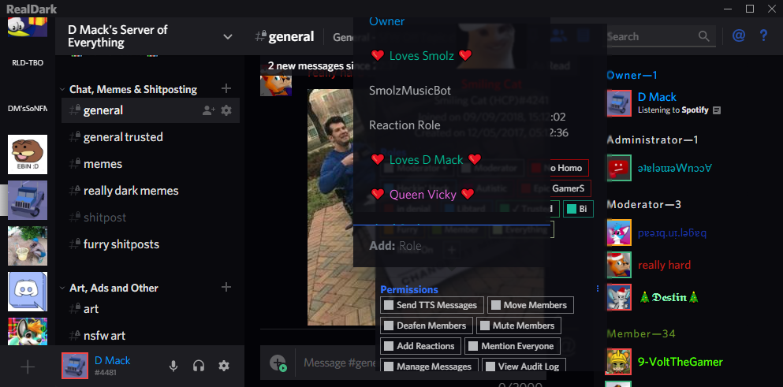
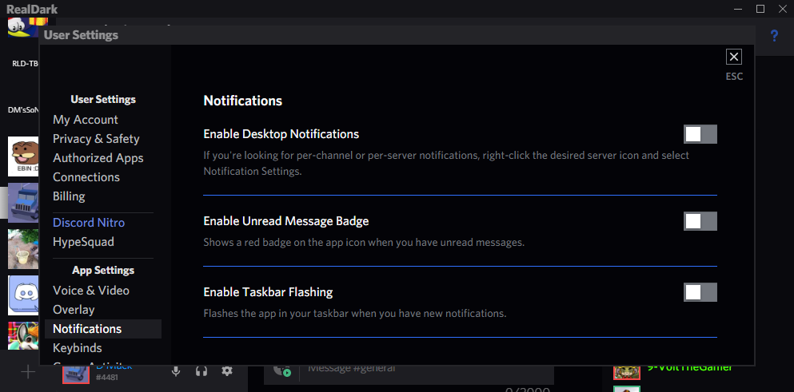

[dmackserv]: https://discord.gg/4GJvzEp
# RealDark
## [Support Server][dmackserv] 
## A BetterDiscord dark/black theme that boasts enhanced usability, readability, customisation and experimental features, which include...
Adding your own window title 
Optional reloval of Spotify Premium elements 
Optional rounded or square icons 
Blurred (or glass) popup backgrounds! (currently being redone) 
## fixed Discord bugs being:
User popouts being unusable on medium-small screens 
Many roles making user popouts unusable 
Connecting screen being boring

 Currently not available on the official repo.
