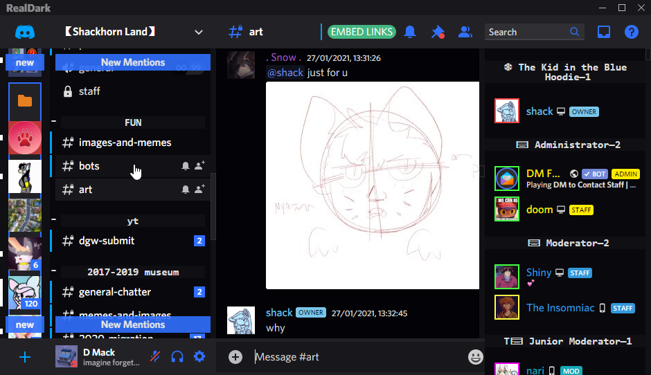
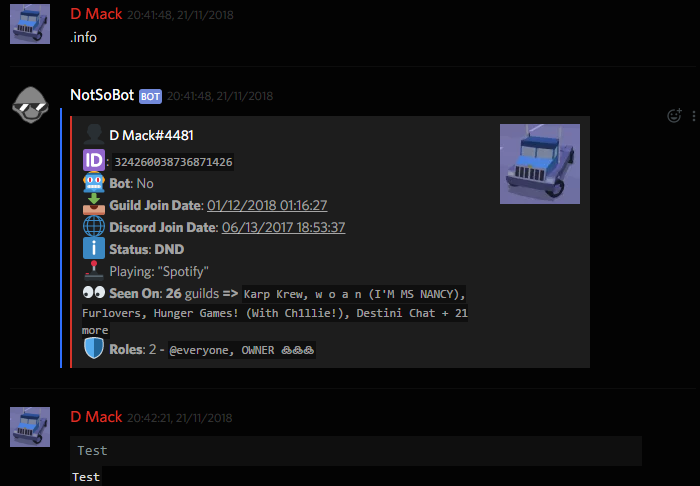
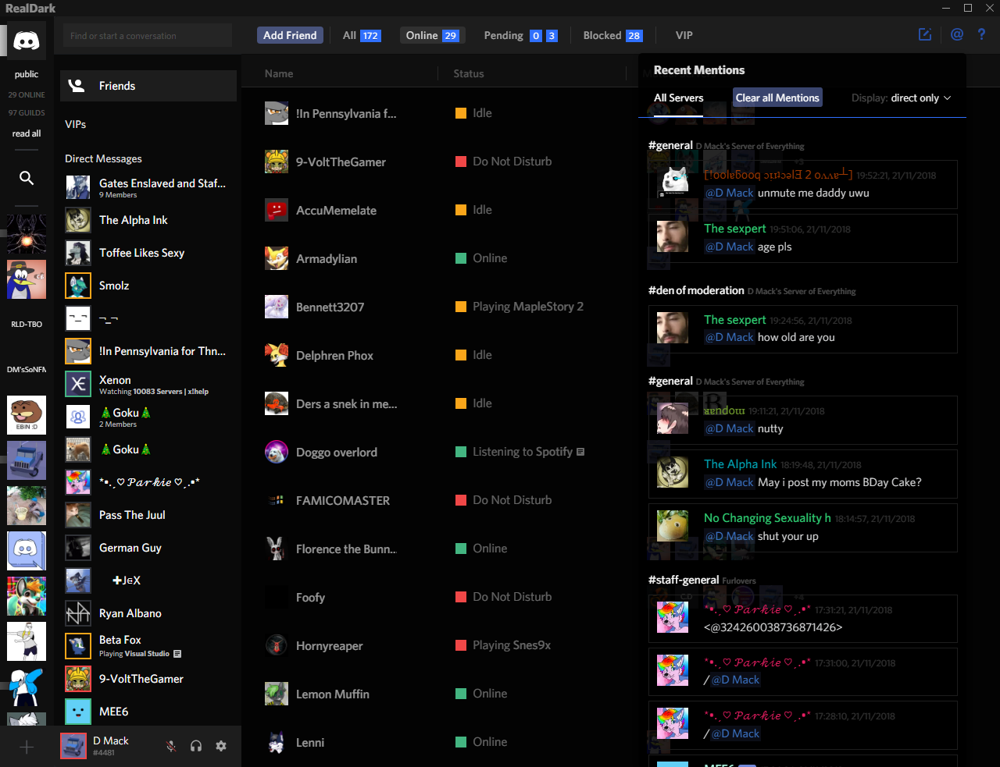
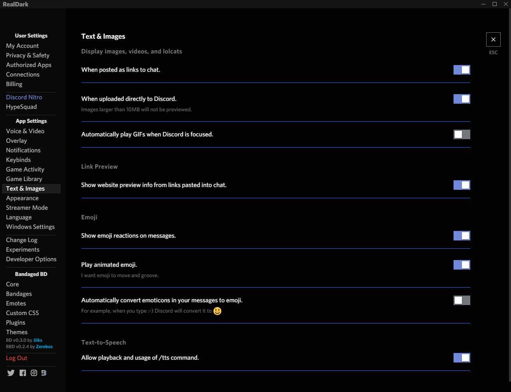
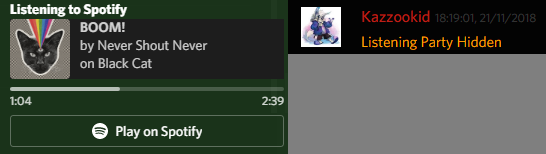

[dmackserv]: https://discord.gg/pB2SmhC
# RealDark
## [Support Server][dmackserv] 
## A BetterDiscord dark/black theme that boasts enhanced usability, readability, customisation and experimental features, which include...
Adding your own window title 
Optional removal of Spotify Premium elements 
Optional rounded or square icons 
Blurred (or glass) popup backgrounds! (currently being redone) 
...and much more!! (official powercord support coming soon) 
 
# Notes
I recommend you add an external RadialStatus theme -- RealDark can automatically configure it if it's present! 
Newer configuration themes can be mismatched with an older base theme that supports them, but your mileage may vary if you do it the other way around! 

 Currently not available on the official repo.
